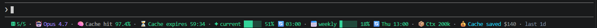
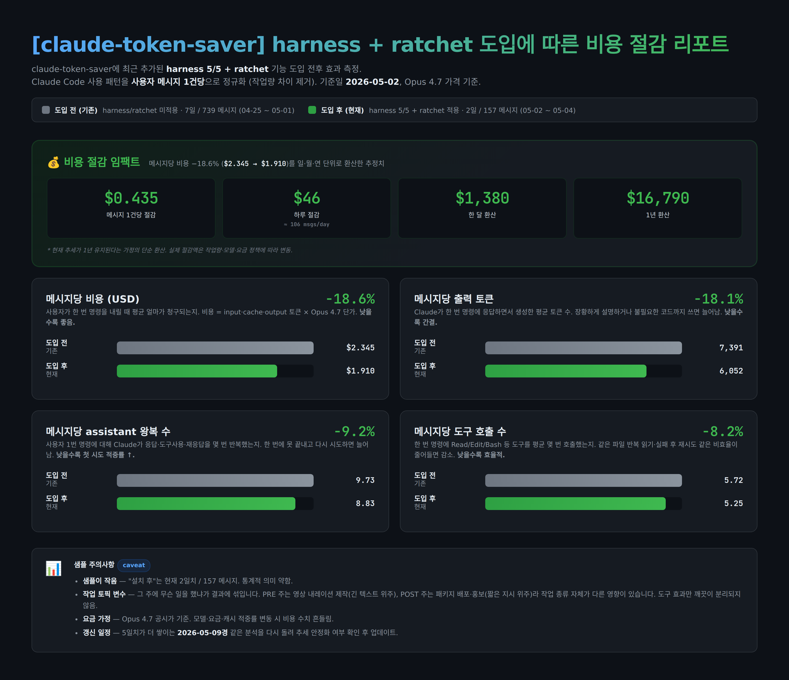

**한국어** · [English](./README.en.md)

[](https://www.youtube.com/@DeepPulseKR)
[](https://www.npmjs.com/package/claude-token-saver)

# claude-token-saver

> v2.0에서 `claude-cache-monitor` → `claude-token-saver`로 이름이 바뀌었습니다. 기존 사용자는 아래 [마이그레이션](#마이그레이션-claude-cache-monitor에서) 항목을 참고하세요.

Claude Code의 **토큰 사용량을 진단·절약**하는 CLI. 캐시 히트율, TTL 카운트다운, 1M 컨텍스트 감지, 5h/7d 한도 경고를 statusline 한 줄로 보여줍니다.



📺 [출시 영상 (60초)](https://www.youtube.com/shorts/RaD8qMsPTnA)

## 실제 효과 — harness 5/5 + ratchet 적용 전후



저자 본인의 Claude Code 사용 로그를 **사용자 메시지 1건당**으로 정규화해 비교한 결과 (2026-05-02 적용 시점, Opus 4.7 가격 기준):

| 메트릭 | 설치 전 (7일 / 739msg) | 설치 후 (2일 / 157msg) | 변화 |
|---|---:|---:|---:|
| 메시지당 비용 | $2.345 | $1.910 | **−18.6%** |
| 메시지당 출력 토큰 | 7,391 | 6,052 | −18.1% |
| 메시지당 assistant 왕복 | 9.73 | 8.83 | −9.2% |
| 메시지당 도구 호출 | 5.72 | 5.25 | −8.2% |

> ⚠️ **샘플 주의** — POST 데이터는 2일치(157 msgs)로 통계적 의미가 약하고, 그 주에 무슨 작업을 했냐(긴 텍스트 vs 짧은 지시)가 결과에 섞여 있습니다. 5일치가 더 쌓이는 **2026-05-09경** 같은 분석을 다시 돌려 갱신할 예정입니다.

---

## 설치

### 사전 준비 — Node.js (≥ 18) 필요

`npm`은 Node.js에 포함되어 있습니다. 설치돼 있는지 확인:

```bash
node -v   # v18.0.0 이상이면 OK
```

설치되어 있지 않다면:

- **macOS** — `brew install node` (Homebrew) 또는 [nodejs.org](https://nodejs.org/) 설치 프로그램
- **Windows** — [nodejs.org](https://nodejs.org/) LTS 설치 프로그램, 또는 `winget install OpenJS.NodeJS.LTS`
- **Linux / WSL** — 배포판 패키지 매니저(`apt install nodejs npm` 등) 또는 [nvm](https://github.com/nvm-sh/nvm)으로 사용자 영역 설치 (sudo 없이 가능, 추천)

> sudo로 글로벌 설치하면 postinstall 훅이 root의 `~/.claude`에 SKILL을 만들어 자동 등록이 어긋납니다. 가능하면 nvm/fnm/Volta로 사용자 영역에 Node를 설치하거나 `npm config set prefix ~/.npm-global` 같은 prefix 변경 후 사용하세요.

### claude-token-saver 설치

```bash
# (기존 사용자) 구 패키지 제거
npm uninstall -g claude-cache-monitor

# 설치 — postinstall 훅이 Skill과 statusline을 자동 등록합니다
npm i -g claude-token-saver
```

설치 없이 한 번만 실행하려면 `npx claude-token-saver`.

`--ignore-scripts`나 sudo 등으로 postinstall이 실행되지 않은 환경에서는 다음 명령으로 수동 등록할 수 있습니다.

```bash
claude-token-saver install
```

## Claude Code statusline

설치 후 Claude Code 하단 statusline에 캐시 상태가 5초마다 갱신됩니다 (postinstall이 `~/.claude/settings.json`에 자동 등록).

```
🤖 Opus 4.7 · 🧠 Cache hit 98.0% · ⏳ Cache expires 58:38 · ✦ current █░░░░░ 15% 🔄 08:50 · 📅 weekly █▒░░░░ 24% 🔄 Thu 13:00 · 📦 Ctx 200k · 💰 Cache saved $205 · last 1d
```

세그먼트 — `🤖 모델` · `🧠 캐시 히트율` · `⏳ TTL 카운트다운` · `✦ current` (5시간 윈도) · `📅 weekly` (7일 윈도) · `📦 컨텍스트` · `💰 누적 절감액` · `last <기간>`.

토큰이 과도하게 사용되는 상황이 감지되면 경고 칩이 맨 앞에 노출됩니다.

```
🚨 5H 94% (resets in 12m) · 🤖 Opus 4.7 · 🧠 Cache hit 72.1% · ⚠ Cache miss · ✦ current ██████ 94% · 📦 Ctx 200k · last 1d
```

경고 칩 종류 — `🚨 5H/7D NN%`, `⚠ 1M ON`, `⚠ Input spike`, `⚠ Cache miss`, `⚠ 5m TTL`, `⚠ Rebuild churn`, `⚠ Output heavy`, `⚠ Call surge`.

**해야 할 일** — Claude에서 `/claude-token-saver` Skill을 실행하면 됩니다. Skill이 `claude-token-saver last`를 호출해 원인 코드와 단계별 해결 명령을 자동으로 보여줍니다. 칩 문구(예: "5H cap 떴어", "cache miss")만 말해도 동일한 Skill이 자동 활성화됩니다. 자세한 흐름은 아래 [Skill 워크플로](#경고-칩이-떴을-때--skill-워크플로) 참고.

수동 등록이 필요한 경우(다른 statusline을 이미 쓰고 있어 postinstall이 건너뛴 경우 등):

```json
{
  "statusLine": {
    "type": "command",
    "command": "claude-token-saver --statusline --icon",
    "refreshInterval": 5
  }
}
```

`refreshInterval: 5`는 idle 상태에서도 TTL 카운트다운을 5초마다 갱신합니다. Windows(PowerShell)는 `examples/statusline-command.ps1` 참고.

## 경고 칩이 떴을 때 — Skill 워크플로

설치 시 함께 등록되는 Claude Code Skill이 "경고 칩 → 처방"의 다리 역할을 합니다.

1. **statusline에 경고 칩이 뜬다** — 예: `🚨 5H 94%`, `⚠ Cache miss`, `⚠ 1M ON`.
2. **`/claude-token-saver` Skill을 실행한다** — Claude에서 슬래시로 Skill을 직접 호출하는 게 가장 간단합니다. 또는 칩 문구를 그대로 말해도 동일한 Skill이 자동 활성화됩니다 ("5H cap 떴어", "cache miss 떴어", "1M context 왜 켜졌지?" 등 — 칩 텍스트가 트리거 단어로 등록돼 있음).
3. **Skill이 처방을 가져온다** — 내부적으로 `claude-token-saver last`를 실행해 가장 최근 경고 + 원인 코드 + 단계별 해결 명령을 한 번에 보여주고, 캡 임박 시에는 `claude-token-saver handoff`로 현재 작업 백업을 권합니다.
4. **수동 확인이 필요하면** — `claude-token-saver last` (최근 1건), `claude-token-saver history` (최근 7일 전이 로그), `claude-token-saver handoff` (cap 직전 백업)를 직접 실행해도 같은 정보를 얻을 수 있습니다.

> v2.6.0에서 레거시 `/token-monitor` 슬래시 커맨드는 이 Skill로 흡수됐습니다. 이전 버전 사용자는 `claude-token-saver install`을 한 번 더 실행하면 자동 정리됩니다.

## 단발 리포트

`claude-token-saver`를 실행하면 최근 1일 진단 표가 출력됩니다.

```
  Claude Token Saver — Last 1 day
  (claude-token-saver v2.9.0)
  ══════════════════════════════════════════════════

  Context window: 200k  ✓ 200k context (standard)
  Sessions: 11  |  API calls: 578  |  Cache hit rate: 98.0%
  TTL Breakdown / Cost Impact / Daily Trend …
```

급증 세션이 있으면 상단에 `⚠ Spike detected` 블록과 원인 코드(아래 표) · OS별 해결 명령이 함께 출력됩니다.

## 출력 언어 전환

`last` / `history` / 처방 메시지는 영어가 기본값이며 한 번에 한 언어만 출력합니다 (statusline 칩은 항상 동일한 기호 형식). 한국어로 바꾸려면:

```bash
claude-token-saver mode ko    # 또는: claude-token-saver mode lang=ko
claude-token-saver mode en    # 영어로 복귀
claude-token-saver mode       # 현재 설정 확인
```

## 주요 명령

아래 명령은 모두 **셸(터미널)에서 직접 실행**합니다. Claude Code 세션 안에서는 `/claude-token-saver` Skill 하나만 쓰며, Skill이 내부적으로 이 명령들을 호출합니다. `--statusline` 형식은 Claude Code가 statusline 갱신마다 자동으로 호출하므로 사용자가 직접 입력하지 않습니다.

| 명령 | 설명 |
|---|---|
| `claude-token-saver` | 최근 1일 진단 리포트 (`--days N`로 기간 변경) |
| `claude-token-saver last` | 가장 최근 경고 1건 + 처방 (Skill이 호출하는 명령) |
| `claude-token-saver history` | 최근 7일간 칩 전이 로그 (1M ON, Cache miss, cap 등) |
| `claude-token-saver handoff` | 현재 작업을 `HANDOFF-YYYY-MM-DD-HHMM.md`로 백업 (cap 임박 시) |
| `claude-token-saver mode [keywords...]` | 출력 모드 설정 (`icon`/`text`, `ko`/`en`, `verbose`, `1d`/`7d` 등) |
| `claude-token-saver --statusline --icon` | statusline용 한 줄 출력 (Claude Code가 호출) |
| `claude-token-saver install` | Skill·statusline 수동 등록 (postinstall이 막힌 환경) |
| `claude-token-saver --install-hook` | 매 도구 호출마다 캐시 통계 자동 로깅 (선택) |

전체 옵션은 `--help` 또는 [영문 README](./README.en.md#options).

## 🅷 Harness 모드

다섯 가지 원칙(Ratchet, Evidence, PEV, Structured Task, Default Safe Path)을 한 줄 명령으로 `CLAUDE.md`에 셋업하고, statusline에 `🅷 5/5`로 점수화합니다. 같은 에러가 반복되면 `🅷⚠ ratchet?`로 알림이 뜹니다.

```bash
claude-token-saver harness init                # CLAUDE.md(5섹션) + .claude/ratchet.md
claude-token-saver harness check               # 현재 점수
claude-token-saver harness promote <N>         # statusline 경고 #N → ratchet에 한 줄 등록
claude-token-saver harness list                # 등록된 ratchet 룰 번호 매겨 보기
claude-token-saver harness rm <N>              # 룰 삭제 (자동 .bak 백업)
claude-token-saver harness uninit              # harness 블록 제거 (CLAUDE.md 다른 내용은 보존)
claude-token-saver harness off | on            # statusline 🅷 표시 토글
```

### ⚠️ 주의 — `harness rm`은 신중하게

ratchet의 가치는 **"한 방향 누적"**에 있습니다. 룰을 가볍게 지우기 시작하면 같은 실수가 다시 새기 시작합니다. **지우기 전에 다음을 확인하세요**:

- **룰이 너무 광범위해서 정상 케이스도 막나?** → ❌ 삭제 ✅ **조건을 좁혀서 다듬기**
  - 예: `"하드코딩 금지"` → `"테스트 외 코드에서 하드코딩 금지"`
- **룰이 너무 좁아 거의 발동 안 되나?** → ❌ 삭제 ✅ **그냥 두기** (비용 0)
- **정말 잘못된 룰이라 확신?** → ✅ **그때만 삭제**

대부분의 "과도한 ratchet" 문제는 **룰의 표현이 좁지 못해서** 생깁니다. 삭제는 마지막 수단으로 두고, 먼저 `.claude/ratchet.md`를 직접 열어 조건을 다듬는 쪽을 우선하세요. 삭제 시 자동 `.bak`이 남지만, **세션 컨텍스트(왜 그 룰이 박혔는지)는 백업으로 복원되지 않습니다**.

## 토큰 급증 원인 코드

| 코드 | 의미 |
|---|---|
| `LARGE_INPUT_PER_REQUEST` | 단일 요청 250k+ → 1M 컨텍스트 의심 |
| `LOW_HIT_RATE` | 캐시 히트율 50% 미만 |
| `BUCKET_5M_DOMINANT` | 캐시 쓰기의 70% 이상이 5분 버킷에 집중 (Pro 플랜 또는 Max 다운그레이드) |
| `HIGH_OUTPUT_RATIO` | 출력/입력 비율 0.15 초과 (출력 단가가 입력의 5배) |
| `FREQUENT_CACHE_REBUILD` | 캐시 재작성이 읽기보다 많음 |

각 코드마다 OS별 해결 명령(`~/.zshrc` / `setx`)이 함께 출력됩니다.

## 마이그레이션 (claude-cache-monitor에서)

```bash
npm uninstall -g claude-cache-monitor
npm i -g claude-token-saver
```

`~/.claude/settings.json`의 `statusLine.command`를 `claude-cache-monitor …` → `claude-token-saver …`로 교체하세요. v2.0에 잠시 제공됐던 `claude-cache-monitor` 바이너리 별칭은 글로벌 설치 시 npm 충돌(EEXIST)을 일으켜 이후 버전에서 제거됐습니다.

## 동작 원리

Claude Code는 모든 API 응답을 `~/.claude/projects/<dir>/<session>.jsonl`에 기록합니다. 이 도구는 `cache_read_input_tokens`, `cache_creation.ephemeral_5m/1h_input_tokens` 같은 필드를 `requestId` 기준으로 중복 제거한 뒤 일·세션 단위로 집계합니다.

## 환경

Node.js ≥ 18 · macOS / Linux / Windows / WSL · 의존성 0.

## 알려진 환경 이슈

**IntelliJ Claude Code plugin** — statusline 위젯이 이전 프레임과 새 프레임을 글자 단위로 잘못 합쳐 `Cache expires 59:548` 같은 잔재 문자열이 보이는 버그가 있습니다 (이모지가 포함된 출력에서만 재현). v2.8.5+는 `TERMINAL_EMULATOR=JetBrains-JediTerm`을 감지하면 자동으로 text 모드로 폴백해 이모지 없이 출력합니다 (`--icon` 플래그도 IntelliJ에서는 무시됩니다). 다른 터미널(iTerm, Terminal, WSL 등)에는 영향 없습니다.

## 릴리스 노트

### v2.13.1 (2026-05-04)
- README에 실제 statusline 스크린샷과 "harness 5/5 + ratchet 적용 전후 효과" 차트 추가. 자체 사용 로그 기준 메시지당 비용 −18.6%, assistant 왕복 −9.2%, 일/월/년 환산 비용 절감 임팩트 카드 포함. 샘플 주의사항·작업 토픽 변수·갱신 일정(2026-05-09) 명시.
- npm 패키지 메타데이터(homepage / bugs / author) 정비 — DeepPulse YouTube 채널 링크 노출.

### v2.11.0 (2026-05-02)
- `harness list` / `harness rm <N>` 추가. 등록된 ratchet 룰을 번호로 보고 개별 삭제 가능 (자동 `.bak` 백업). 삭제 전 "조건을 좁혀서 다듬기" 우선 검토 안내가 CLI에 표시됩니다. README의 [⚠️ 주의 — `harness rm`은 신중하게](#️-주의--harness-rm은-신중하게) 항목 참고.

### v2.9.4 (2026-04-27)
- README에 Node.js 사전 설치 안내 추가 (macOS/Windows/Linux별). GitHub에서 처음 본 사용자가 npm 명령부터 막히는 일을 방지. sudo 글로벌 설치 시 postinstall이 root 홈에 SKILL을 만드는 함정도 함께 안내.

### v2.9.3 (2026-04-27)
- Skill 본문(`SKILL.md`)에 "사용자 설정 언어로 응답" 지시 추가. 이전엔 Skill이 호출돼도 Claude가 영어로 요약을 생성하는 탓에 `mode ko` 상태에서도 영문 답이 나왔습니다 (`All clear - no warnings...` 같은 문구).
- `installSkill`이 번들된 SKILL.md와 디스크의 내용이 다르면 자동 갱신하도록 변경 (`--force` 없이도 업그레이드 시 새 지시가 적용됨).

### v2.9.2 (2026-04-27)
- `last`/`history`가 경고 없을 때 출력하는 안내 문구도 언어 설정을 따르도록 수정 (이전엔 항상 영문 출력 → 한국어 모드인데도 영문이 보이는 버그).

### v2.9.1 (2026-04-27)
- README의 statusline 예시를 실제 출력(`✦ current` / `📅 weekly` 윈도 세그먼트 포함)으로 정정.
- "경고 칩이 떴을 때" Skill 워크플로 4단계 가이드 추가 — 칩 발견 → Claude에게 칩 문구 그대로 말하기 → Skill이 `last` 실행 → 처방 적용.
- `language` 설정 위치를 `cfg.statusline` 하위에서 top-level `cfg.language`로 이동(statusline 토글이 아니므로). 구버전 위치도 fallback으로 계속 읽어 마이그레이션은 자동. `mode` 출력도 statusline / output language를 분리해서 표시.

### v2.9.0 (2026-04-27)
- **출력 언어 전환 추가** — `last` / `history` / 처방 메시지가 한 번에 한 언어만 출력합니다. 기본은 영어, `claude-token-saver mode ko`로 한국어 전환 (statusline 칩은 영향 없음).
- 기존 history 파일은 이중언어로 보관되며, 표시할 때 선택한 언어만 필터링됩니다.

### v2.8.6 (2026-04-27)
- **Skill 자동 등록** — `npm i -g claude-token-saver` 시 postinstall 훅이 Skill과 statusline을 자동으로 `~/.claude`에 등록. 수동 `claude-token-saver install`은 `--ignore-scripts` / sudo 환경용 폴백으로 유지.
- 한·영 README 문장 다듬기, `claude-cache-monitor` alias 제거 시점 설명 정정.

### v2.8.5
- IntelliJ Claude Code plugin에서 statusline 프레임 합성 버그 회피 — `TERMINAL_EMULATOR=JetBrains-JediTerm` 감지 시 자동 text 모드.

이전 버전은 `git log`를 참고하세요.

## 라이선스

MIT
